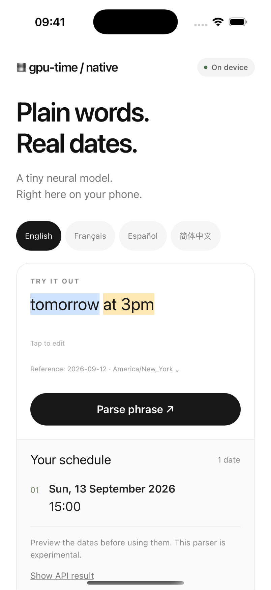
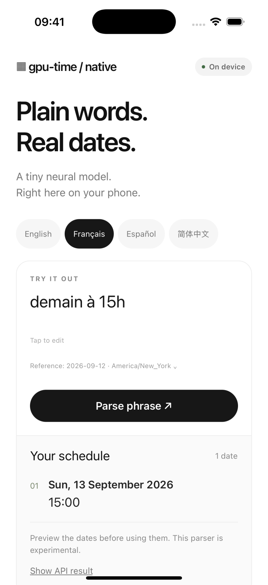
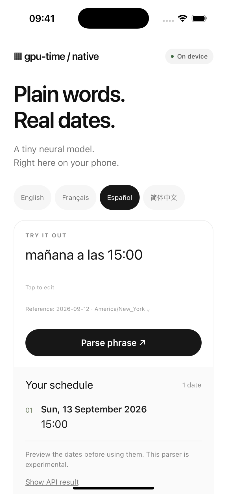
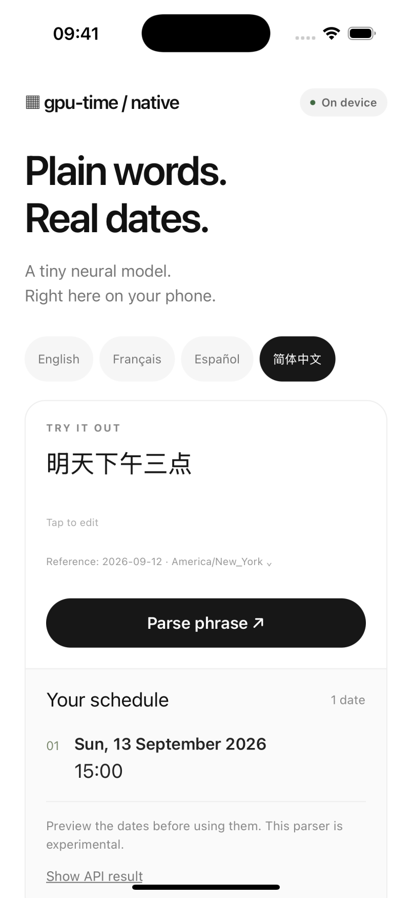

# react-native-gpu-time

Turn short English, French, Spanish, and Simplified Chinese date expressions into dates, time ranges, and recurrence rules, entirely on-device.

A React Native port of [gpu-time](https://github.com/arikchakma/gpu-time) by Arik Chakma. It uses the original embedded model on the CPU, has no runtime dependencies, and needs no API key, model download, native module, or WebView.

**Status: experimental.** English uses the original trained model. French, Spanish, and Simplified Chinese use deterministic language packs that normalize supported phrases into English before inference. These packs do not provide unrestricted natural-language understanding. Read [language support](docs/languages.md) before using them.

## Preview

The Expo example uses New York time. These screenshots come from the running iOS app.

<p>
  
  
</p>
<p>
  
  
</p>

[Preview files and capture instructions](docs/images/README.md)

## Install

Install the archive from the [v0.1.0 GitHub prerelease](https://github.com/AdzeB/react-native-gpu-time/releases/tag/v0.1.0) in your React Native or Expo app:

```sh
npm install https://github.com/AdzeB/react-native-gpu-time/releases/download/v0.1.0/react-native-gpu-time-0.1.0.tgz
```

The package is distributed through GitHub Releases. It has not been published to npm.

To build the archive yourself, clone this repository, run `npm ci`, then `npm pack`.

## Use it

```ts
import { parse } from "react-native-gpu-time";

const result = await parse(
  "demain à 15h",
  {
    reference: "2026-09-12T12:00:00-04:00",
    timeZone: "America/New_York",
    limit: 5,
  },
  { language: "fr" },
);

result.occurrences;
// [{ start: '2026-09-13T15:00:00-04:00', allDay: false }]
result.language; // 'fr'
result.normalizedText; // 'tomorrow at 15:00'
result.diagnostics; // []
```

The reference instant and IANA timezone are always explicit. In a real app, pass `new Date().toISOString()` when interpreting relative phrases. Do not keep a stale reference in a long-lived screen.

### Reuse a parser

```ts
import { defineParser } from "react-native-gpu-time";

const parser = await defineParser({ language: "es", dateOrder: "DMY" });
try {
  const results = await parser.parseMany(
    ["mañana a las 15:00", "cada lunes a las 20:00"],
    {
      reference: new Date().toISOString(),
      timeZone: "Europe/Madrid",
      limit: 5,
    },
  );
  // results preserve input order
} finally {
  parser.dispose();
}
```

Exports: `parse`, `parseMany`, `defineParser`, `languages`, `english`, `french`, `spanish`, `chinese`, and TypeScript types including `LanguagePack`, `ParserOptions`, `ParseContext`, and `ParseResult`.

| Option      | Behavior                                                                |
| ----------- | ----------------------------------------------------------------------- |
| `language`  | `'en'` (default), `'fr'`, `'es'`, `'zh-CN'`, or a custom `LanguagePack` |
| `dateOrder` | `'MDY'` or `'DMY'`; defaults to the pack's convention                   |
| `backend`   | `'cpu'` only; GPU requests reject explicitly                            |
| `reference` | ISO instant with an offset or `Z`, required in parse context            |
| `timeZone`  | IANA timezone, required in parse context                                |
| `limit`     | 1–1000; defaults to 30; bounds preview occurrences                      |

`ParseContext` also retains upstream `weekStart`, `bareWeekday`, `bareWeekdays`, `nextWeekday`, `dayParts`, and `until` options. The shipped declarations document their exact types.

Results contain `occurrences`, `rrules`, `diagnostics`, `truncated`, `backend`, `timings`, and `language`. Non-English results include `normalizedText` when normalization succeeds. Each occurrence has `start`, optional `end`, optional `open`, and `allDay`. All-day range ends are exclusive. `rrules` contains RFC 5545 property strings, which can include `DTSTART` and `RRULE` separated by a newline.

Invalid context rejects the promise. Unsupported wording returns no occurrences and an `unsupported-language-input` diagnostic. A wrong model prediction may still produce a date without a diagnostic. Let the user review the result.

### React Native behavior

- The returned Promise does **not** move inference off the JavaScript thread. Use short inputs; avoid large batches in scrolling or typing handlers. The example parses on submit and limits its text field to 500 characters.
- Bundles contain portable JavaScript, with Unicode property regexes lowered during build. No global polyfills are installed by the package.
- Timezone resolution requires `Intl.DateTimeFormat.formatToParts` and IANA timezone data. Use a current Hermes runtime. Older/custom runtimes may need an application-owned Intl polyfill loaded before parser creation.
- Parser disposal rejects queued and future calls. Embedded weights and bounded CPU/calendar caches remain shared at module scope.
- No automatic language detection or translation service is used. Choose the input language explicitly. Formatting output dates in another locale is a separate UI decision.

## Run the example

The example uses Expo SDK 57, React Native 0.86, and the **packed library**, not private source imports. Its white/black theme, soft gray cards, and pastel highlights follow the upstream website, with mobile language controls and an API result inspector.

```sh
git clone https://github.com/AdzeB/react-native-gpu-time.git
cd react-native-gpu-time
npm ci
npm run example:install
cd example
npm start
```

Open it in Expo Go on iOS or Android. Tap a language, choose a sample or edit the phrase, and select **Parse phrase**. The reference defaults to a fixed instant so the sample results are reproducible; expand the reference row to change it.

The footer's **Run compatibility checks** executes public-API fixtures on the actual device runtime. Phrase colors are presentation hints adapted from the website, not model confidence or token predictions. English receives these visual hints; other languages show their original text without guessed highlights.

If macOS resolves the Metro bind address to IPv6 while Expo Go requests IPv4, start with:

```sh
NODE_OPTIONS=--dns-result-order=ipv4first npx expo start --localhost
```

## Develop and contribute

```sh
npm ci
npm run verify
npm run example:install
npm --prefix example run check
cd example
npx expo export --platform ios --platform android
```

The build verifies the upstream model SHA-256, emits ESM, CommonJS, and TypeScript declarations, and enforces the original 50,000-byte Brotli budget for each JavaScript entry. Compressed size is a distribution metric, not installed app memory usage.

See [CONTRIBUTING.md](CONTRIBUTING.md) for adding languages, [VALIDATION.md](VALIDATION.md) for verified platforms and test results, and [UPSTREAM.json](UPSTREAM.json) for source provenance. No model retraining is necessary to contribute a language pack.

MIT licensed. Original model, parser, and website presentation helpers are by Arik Chakma. The upstream limitations remain applicable; see [MODEL_CARD.md](MODEL_CARD.md).
